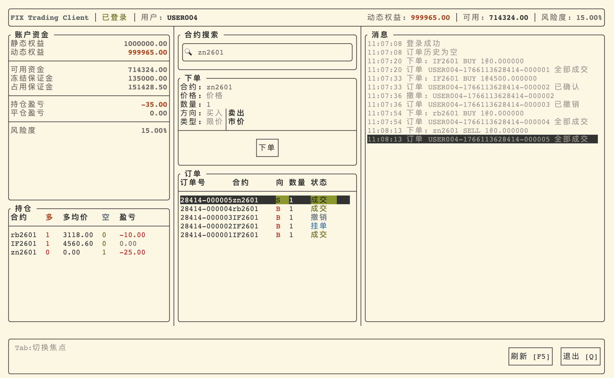

# FIX 4.0 模拟交易 Demo

一个基于 C++17 的 FIX 4.0 协议练习项目，包含服务端撮合模拟与终端客户端（TUI），用于演示会话层、订单回报、账户/持仓更新与持久化等基础流程。

## 功能

### 服务端 (fix_server)
- FIX 4.0 会话层：Logon、Heartbeat、TestRequest、Logout、ResendRequest/重传（带持久化 store）
- 业务消息：NewOrderSingle (D)、OrderCancelRequest (F)、ExecutionReport (8)
- 自定义业务消息：
  - 资金查询 (U1/U2)、持仓查询 (U3/U4)
  - 账户推送 (U5)、持仓推送 (U6)
  - 合约搜索 (U7/U8)、订单历史 (U9/U10)
- 行情驱动撮合引擎（限价/市价）
- 账户与持仓管理：保证金冻结/释放、浮动盈亏与平仓盈亏
- SQLite 持久化：账户/持仓/订单/成交 + 会话消息 store（可在 `config.ini` 中关闭）
- SimNow/CTP 行情与合约查询（可选）

### 客户端 (fix_client)
- 终端 TUI 界面（基于 FTXUI）
- 实时显示账户资金、持仓、订单（订单历史由服务端返回）
- 合约搜索（支持模糊匹配）
- 下单、撤单（订单栏回车弹出撤单确认窗口）

## 截图



## 架构概览

```
┌─────────────────────────────────────────────────────────────┐
│                      应用层 (Application)                    │
│         SimulationApp / ClientApp / TUI                     │
├─────────────────────────────────────────────────────────────┤
│                      业务层 (Business)                       │
│    MatchingEngine / AccountManager / PositionManager        │
│    InstrumentManager / RiskManager                          │
├─────────────────────────────────────────────────────────────┤
│                      协议层 (Protocol)                       │
│         Session (状态机) + SessionManager + FixCodec         │
├─────────────────────────────────────────────────────────────┤
│                      网络层 (Network)                        │
│              Reactor + Connection + ThreadPool              │
├─────────────────────────────────────────────────────────────┤
│                      基础设施 (Infrastructure)               │
│            TimingWheel + Config + Logger + Store            │
└─────────────────────────────────────────────────────────────┘
```

## 构建

依赖：
- C++17 编译器 (GCC 8+ / Clang 7+ / MSVC 2019+)
- CMake 3.10+
- SQLite3
- Linux (epoll) 或 macOS (kqueue)
- 首次构建会通过 CMake FetchContent 拉取依赖（FTXUI / RapidCheck），需要网络

```bash
cmake -S . -B build
cmake --build build -j
```

## 运行

### 服务端

```bash
# 基本启动
./build/fix_server

# 指定端口和线程数
./build/fix_server -p 9000 -t 4

# 使用指定 config.ini
./build/fix_server -c config.ini

# 启用 SimNow/CTP（读取 simnow.ini）
./build/fix_server -s simnow.ini

# 查看帮助
./build/fix_server -h
```

### 客户端

```bash
# 连接服务端
./build/fix_client -h 127.0.0.1 -p 9000 -u USER001

# 查看帮助
./build/fix_client --help
```

TUI 操作：
- `Tab` - 板块间切换焦点
- `↑/↓` - 在当前板块选择条目（例如搜索下拉、订单列表）
- `Enter` - 在订单栏打开撤单确认弹窗
- `Esc` - 关闭弹窗/关闭搜索下拉
- `F5` / `R` - 刷新资金/持仓/订单历史
- `Q` - 退出（在输入框聚焦时不会抢占字符输入）

## 配置

### config.ini
通用配置（服务端/客户端都可用），构建后会复制到 `build/config.ini`。

关注项：
- `[server]` 端口、线程数
- `[fix_session]` 心跳与超时
- `[storage] db_path` SQLite 数据库路径
  - 默认 `fix_server.db`
  - 设为空字符串可禁用持久化（所有状态仅保存在内存）

### simnow.ini
SimNow/CTP 配置文件（可选），用于：
- 从 CTP Trader 查询合约静态信息（合约乘数、最小变动价位等）
- 从 CTP MD 订阅行情并驱动撮合

模板见 `simnow.ini.example`（key=value 格式；可包含注释行）。

```ini
broker_id = 9999
user_id = YOUR_USER_ID
password = YOUR_PASSWORD
md_front = tcp://182.254.243.31:40011
td_front = tcp://182.254.243.31:40001
flow_path = ./ctp_md_flow/
trader_flow_path = ./ctp_trader_flow/
```

说明：
- 当前 demo 的合约保证金率在 CTP 路径下使用固定默认值（见 `src/market/ctp_trader_adapter.cpp` 的注释），未对接 `ReqQryInstrumentMarginRate`。

## 测试

```bash
# 单元测试（tests/ 是单独的 CMake 工程）
cmake -S tests -B tests/build
cmake --build tests/build -j
./tests/build/unit_tests

# E2E（当前仅提供开/平仓流程脚本）
./tests/e2e/test_open_close.sh
```

## 目录结构

```
├── include/           # 头文件
│   ├── app/          # 应用层
│   ├── base/         # 基础设施
│   ├── core/         # 网络核心
│   ├── fix/          # FIX 协议
│   ├── market/       # 行情适配器
│   └── storage/      # 存储
├── src/              # 源文件
│   ├── server/       # 服务端入口
│   ├── client/       # 客户端 + TUI
│   └── ...
├── tests/            # 测试
│   ├── unit/         # 单元测试
│   └── e2e/          # 端到端测试
└── third_party/      # 第三方库
```

## 局限

- 仅支持单机部署
- 无消息加密
- 行情撮合为模拟逻辑，非真实交易所撮合规则
- SimNow/CTP 依赖交易前置与交易时段，且保证金率等参数未做到全量对齐

