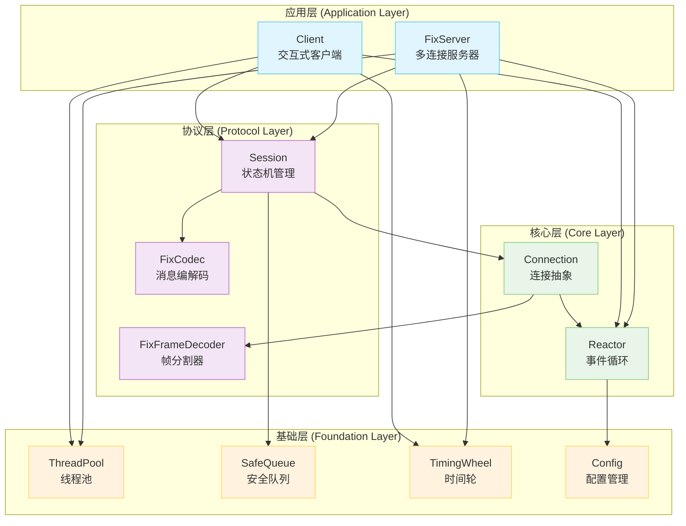
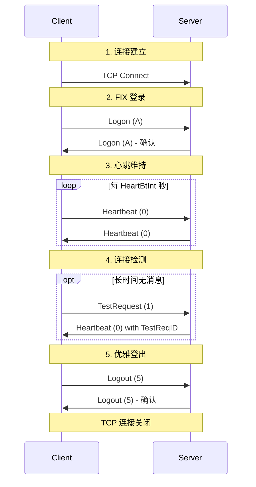
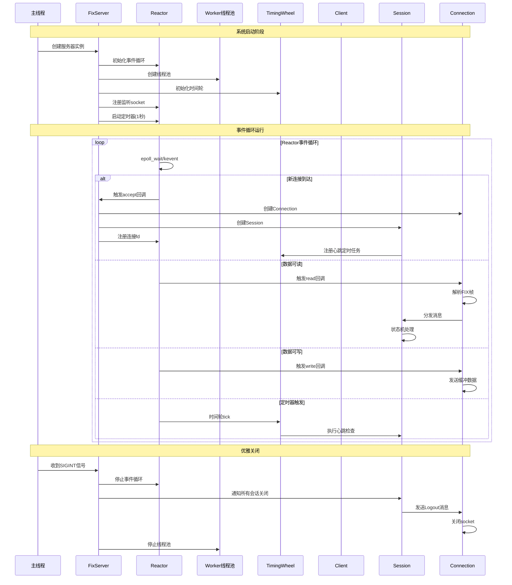
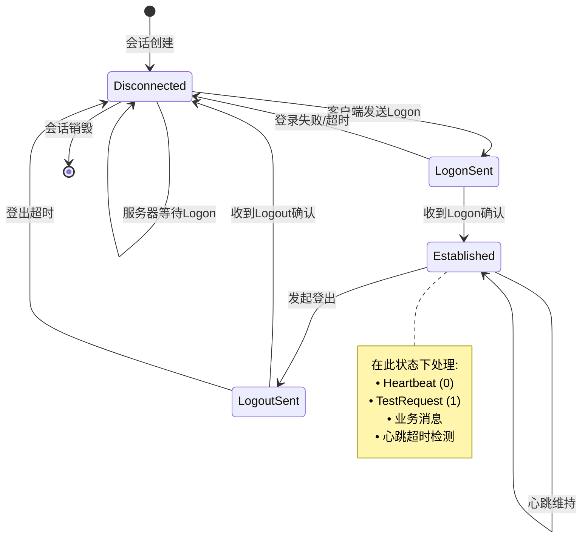
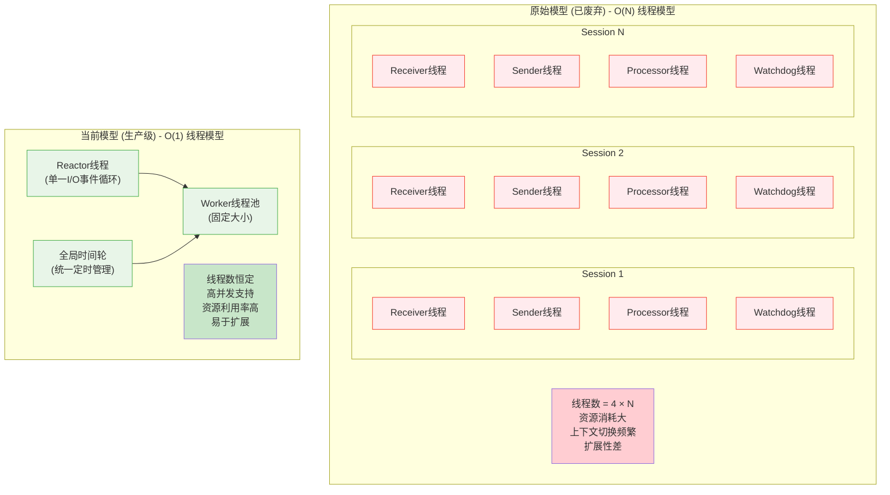
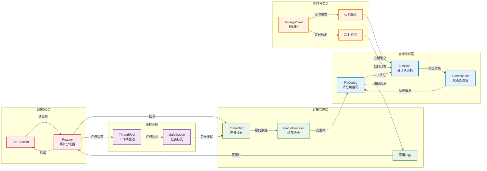
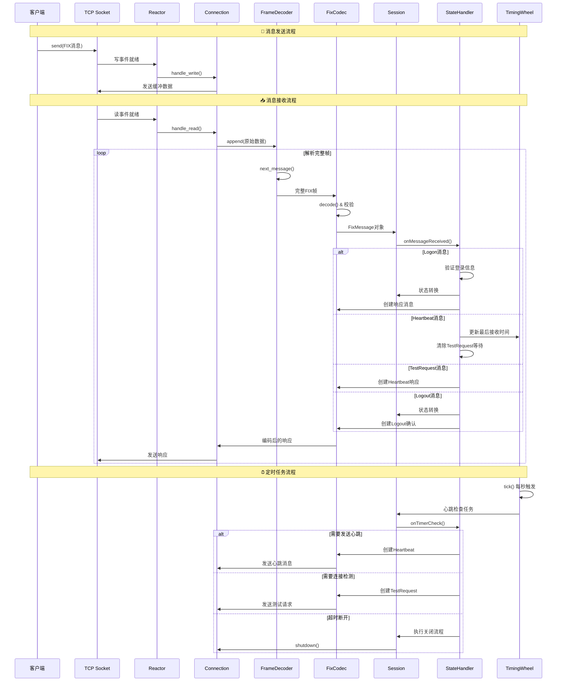

# FIX 4.0 引擎与交易服务器/客户端

本项目是一个基于 C++17 实现的、跨平台的、生产级金融信息交换协议 (FIX) 4.0 引擎。它包含一个高性能的多连接交易服务器和一个交互式客户端，展示了现代 C++ 在高性能网络编程和金融科技领域的最佳实践。

## 🚀 核心特性

### 网络架构
- **高性能 Reactor 模式**: 基于 epoll (Linux) / kqueue (macOS) 的事件驱动架构
- **边缘触发 I/O**: 非阻塞 I/O 和边缘触发模式，最大化性能
- **O(1) 线程模型**: Reactor + Worker 线程池，支持大量并发连接
- **智能缓冲管理**: 自适应读写缓冲区，防止内存泄漏

### FIX 协议实现
- **完整的 FIX 4.0 支持**: Logon(A), Heartbeat(0), TestRequest(1), Logout(5)
- **流式消息解析**: 高效的 FIX 帧分割器，支持不完整消息处理
- **严格协议校验**: 自动 BodyLength/CheckSum 计算与验证，序列号管理
- **状态机驱动**: 清晰的会话状态管理 (Disconnected → LogonSent → Established → LogoutSent)
- **智能心跳机制**: 自动心跳发送、连接活性检测和超时处理

### 现代 C++ 设计
- **C++17 标准**: 充分利用智能指针、原子操作、完美转发等现代特性
- **RAII 资源管理**: 自动资源清理，力求避免任何内存泄漏
- **线程安全**: 无锁数据结构和原子操作，避免死锁
- **异常安全**: 完善的错误处理和优雅关闭机制

## 🛠️ 技术栈

- **语言**: C++17 (GCC 7+ / Clang 5+)
- **构建系统**: CMake 3.10+
- **网络层**: 
  - I/O 多路复用: `epoll` (Linux), `kqueue` (macOS)
  - 协议: TCP Socket, 非阻塞 I/O
- **并发模型**:
  - 线程池: `std::thread`, `std::future`, `std::packaged_task`
  - 同步原语: `std::atomic`, `std::mutex`, `std::condition_variable`
  - 无锁队列: `SafeQueue` (生产者-消费者模式)
- **算法与数据结构**:
  - 时间轮 (`TimingWheel`): O(1) 定时器管理
  - 状态机模式: FIX 会话生命周期管理
  - 流式解析器: FIX 消息帧分割

## 🏗️ 架构设计

项目采用**分层架构**，模块职责清晰，易于扩展：



### 各层详细说明

1. **基础层 (`base/`)**：通用基础组件
   - `ThreadPool`: 现代 C++ 线程池，支持任意可调用对象
   - `SafeQueue`: 线程安全队列，支持优雅停止机制
   - `TimingWheel`: 时间轮算法，高效管理大量定时任务
   - `Config`: 单例配置管理器，支持 INI 格式解析

2. **核心层 (`core/`)**：网络 I/O 抽象
   - `Reactor`: 跨平台 I/O 多路复用器，统一 epoll/kqueue 接口
   - `Connection`: 连接生命周期管理，集成 FIX 帧解析和缓冲管理

3. **协议层 (`fix/`)**：FIX 协议完整实现
   - `Session`: FIX 会话状态机，管理登录/心跳/登出流程
   - `FixCodec`: 消息编解码器，自动处理协议字段
   - `FixFrameDecoder`: 流式消息分帧器，处理 TCP 粘包/分包

4. **应用层 (`server/` & `client/`)**：业务应用
   - `FixServer`: 高并发 FIX 服务器，支持多客户端连接
   - `Client`: 交互式 FIX 客户端，支持命令行操作

## 如何构建和运行

### 前提条件

- C++17 兼容的编译器 (GCC, Clang)
- CMake (版本 3.10 或更高)
- Git

### 构建步骤

```bash
# 1. 克隆仓库
# git clone https://github.com/LittlePorcupine/FIX4.0_demo.git
# cd FIX4.0_demo

# 2. 创建 build 目录并运行 CMake
mkdir build
cd build
cmake ..

# 3. 编译项目
make
```

### 运行示例

构建成功后，在 `build` 目录下会生成两个可执行文件：

#### 1. 启动服务器
```bash
./build/fix_server
# 或指定线程数和端口
./build/fix_server 4 9001
```

服务器启动后会显示：
```
Config loaded from /path/to/config.ini
Server listening on port 9000
Worker thread pool size: 8
```

#### 2. 启动客户端
```bash
./build/fix_client
# 或指定服务器地址和端口
./build/fix_client 192.168.1.100 9001
```

客户端连接成功后会自动发送 Logon 消息：
```
Config loaded from /path/to/config.ini
Connecting to 127.0.0.1:9000...
Connected to server.
>>> SEND (3): 8=FIX.4.0^A9=61^A35=A^A49=CLIENT^A56=SERVER^A34=1^A52=20240122-10:30:45^A98=0^A108=30^A10=159^A
<<< RECV (3): 8=FIX.4.0^A9=61^A35=A^A49=SERVER^A56=CLIENT^A34=1^A52=20240122-10:30:45^A98=0^A108=30^A10=159^A
Session (CLIENT): State changing from <Disconnected> to <Established>
Type 'logout' to disconnect.
```

#### 3. 交互操作
在客户端控制台输入：
- `logout`: 发送 Logout 消息并优雅断开连接
- `Ctrl+C`: 强制终止（服务器会检测到连接断开）

## 🔄 FIX 会话流程

### 完整的会话生命周期



### 心跳与超时机制

- **心跳发送**: 当 `HeartBtInt` 秒内无任何消息发送时，自动发送 Heartbeat
- **连接检测**: 当 `1.2 * HeartBtInt` 秒内无消息接收时，发送 TestRequest
- **超时断开**: 当 `1.5 * HeartBtInt` 秒内 TestRequest 无响应时，强制断开连接
- **登出超时**: 发送 Logout 后 10 秒内未收到确认，强制关闭连接

## 🔧 系统运行流程

### 完整的系统启动与运行流程



### FIX 会话状态转换流程



## ⚡ 性能特征

### 并发模型优化历程

项目经历了重要的架构演进，从传统的"每连接多线程"模型优化为现代的"Reactor + 线程池"模式：



**性能对比**:

| 指标 | 原始模型 | 当前模型 | 改进效果 |
|------|----------|----------|----------|
| 线程数量 | 4 × 连接数 | 固定 (CPU核心数+1) | 🚀 O(N) → O(1) |
| 内存占用 | 高 (每线程8MB栈) | 低 (共享线程池) | 📉 减少90%+ |
| 上下文切换 | 频繁 | 最小化 | ⚡ 延迟降低50%+ |
| 并发连接 | 受限 (~100) | 海量 (10000+) | 📈 提升100倍 |
| CPU利用率 | 低效 | 高效 | 🎯 提升3-5倍 |

## 🔧 配置说明

项目通过 `config.ini` 文件进行灵活配置：

```ini
[server]
port = 9000                    # 服务器监听端口
listen_backlog = 128           # TCP 监听队列长度
default_threads = 0            # 工作线程数 (0=CPU核心数)

[client]
server_ip = 127.0.0.1         # 连接的服务器地址
server_port = 9000            # 连接的服务器端口
sender_comp_id = CLIENT       # 客户端标识
target_comp_id = SERVER       # 服务器标识

[fix_session]
default_heartbeat_interval = 30        # 默认心跳间隔(秒)
min_heartbeat_interval = 5             # 最小心跳间隔
max_heartbeat_interval = 120           # 最大心跳间隔
test_request_timeout_multiplier = 1.5  # TestRequest 超时倍数

[timing_wheel]
slots = 60                    # 时间轮槽数
tick_interval_ms = 1000       # 时间轮精度(毫秒)

[protocol]
max_body_length = 4096        # FIX 消息体最大长度
max_buffer_size = 1048576     # TCP 缓冲区最大大小
```


### 核心组件交互关系



## 🧩 核心组件详解

### Reactor 事件循环

```cpp
// 跨平台 I/O 多路复用
#ifdef __linux__
    io_fd_ = epoll_create1(0);
#elif __APPLE__
    io_fd_ = kqueue();
#endif

// 统一的事件处理接口
reactor_->add_fd(socket_fd, [connection](int fd) {
    connection->handle_read();
});
```

### 状态机驱动的会话管理

```cpp
class Session {
    std::unique_ptr<IStateHandler> currentState_;
    
    // 状态转换
    void changeState(std::unique_ptr<IStateHandler> newState);
    
    // 事件分发
    void on_message_received(const FixMessage& msg) {
        currentState_->onMessageReceived(*this, msg);
    }
};
```

### 时间轮定时器

```cpp
// O(1) 定时任务添加
timing_wheel_->add_task(30000, [session]() {
    session->send_heartbeat();
});

// 高效的定时器触发
void TimingWheel::tick() {
    // 处理当前槽的所有任务
    for (auto& task : wheel_[current_tick_]) {
        if (task.remaining_laps == 0) {
            task.callback();
        }
    }
}
```

## 🛡️ 错误处理与容错

### 网络异常处理
- **连接断开**: 自动检测 TCP 连接状态，优雅清理资源
- **读写错误**: 区分 EAGAIN/EWOULDBLOCK 和真实错误
- **缓冲区溢出**: 设置最大缓冲区大小，防止内存耗尽

### FIX 协议错误
- **序列号错误**: 严格验证 MsgSeqNum，检测到错误立即断开
- **校验和错误**: 自动计算和验证 CheckSum 字段
- **消息格式错误**: 完整的 FIX 消息解析异常处理

### 优雅关闭机制
```cpp
// 信号处理
signal(SIGINT, FixServer::signal_handler);

// 优雅停止 Reactor
void signal_handler(int signum) {
    reactor_->stop();  // 停止事件循环
    // 等待所有连接正常关闭
}
```

## 🚀 扩展指南

### 添加新的 FIX 消息类型

1. 在 `fix_tags.hpp` 中定义新的字段标签
2. 在 `fix_messages.hpp` 中添加消息创建函数
3. 在 `Session` 状态处理器中添加消息处理逻辑

```cpp
// 示例：添加 NewOrderSingle (D) 消息
inline FixMessage create_new_order_single(
    const std::string& sender,
    const std::string& target,
    int seq_num,
    const std::string& symbol,
    const std::string& side) {
    
    FixMessage nos;
    nos.set(tags::MsgType, "D");
    nos.set(tags::Symbol, symbol);
    nos.set(tags::Side, side);
    // ... 其他字段
    return nos;
}
```

### 性能调优建议

1. **线程池大小**: 根据 CPU 核心数和业务特点调整
2. **时间轮配置**: 平衡内存使用和定时精度
3. **缓冲区大小**: 根据消息大小和网络条件优化
4. **心跳间隔**: 在连接稳定性和网络开销间找平衡

### 消息处理详细流程



### 监控与诊断

项目内置了详细的日志输出，可以通过以下方式监控系统状态：

```bash
# 启动服务器并重定向日志
./fix_server 2>&1 | tee server.log

# 监控连接数
grep "Accepted new connection" server.log | wc -l

# 监控消息流量
grep "SEND\|RECV" server.log | tail -f

# 监控状态转换
grep "State changing" server.log

# 监控心跳活动
grep "Heartbeat\|TestRequest" server.log
```

## 📚 学习资源

### FIX 协议参考
- [FIX 4.0 规范](https://www.fixtrading.org/standards/)

### C++ 网络编程
- 《Unix 网络编程》- Richard Stevens
- 《C++ 并发编程实战》- Anthony Williams
- 《现代 C++ 设计》- Andrei Alexandrescu

### 设计模式
- Reactor 模式：事件驱动架构的核心
- 状态模式：有限状态机的优雅实现
- RAII 模式：资源管理的最佳实践

---

*本项目旨在学习现代 C++ 在金融科技领域的应用，适合学习网络编程、并发设计和协议实现的开发者参考。*